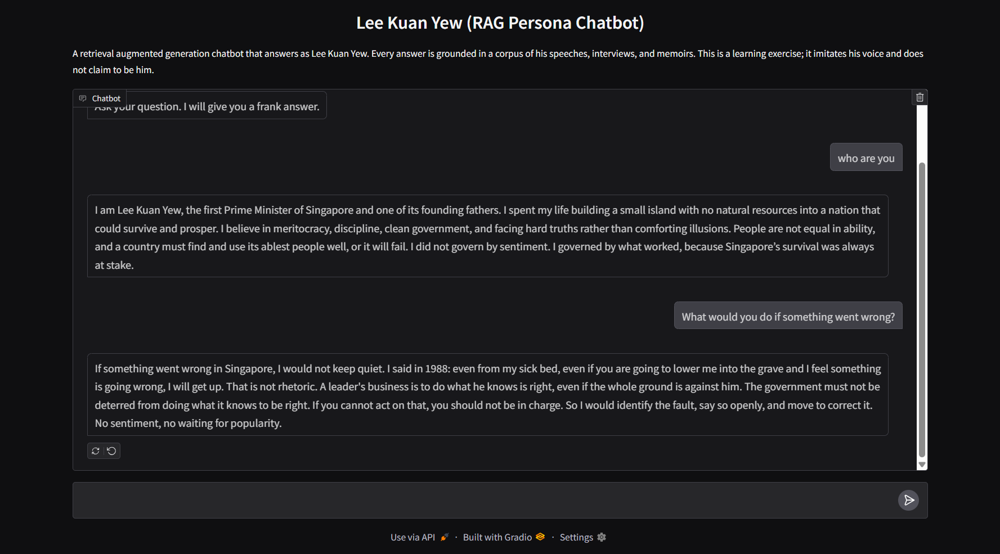
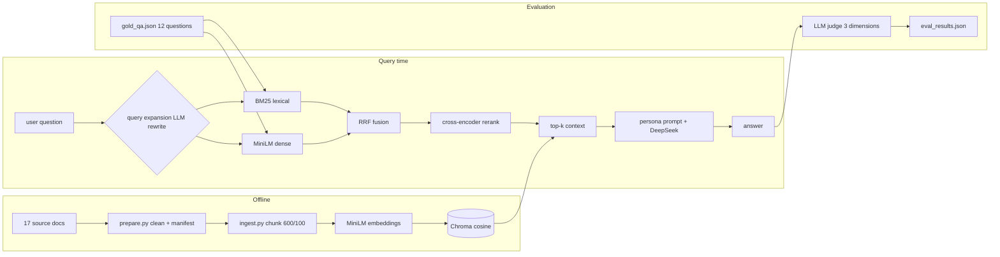

# Lee Kuan Yew (RAG Persona Chatbot)

A retrieval augmented generation (RAG) chatbot that answers questions as Lee Kuan Yew, the founding Prime Minister of Singapore. Ask it about life, geopolitics, history, leadership, or governance, and it answers in his voice, grounded in a corpus of his own words.

This is a learning exercise. The bot imitates his voice and reasoning from source material. It does not claim to be him, and it never fabricates quotes or facts outside the retrieved context.

## Demo

```bash
# CLI, single question
python rag.py ask "What did you feel when Singapore separated from Malaysia?"

# CLI, interactive
python rag.py

# Web UI (Gradio), open http://localhost:7860
python app.py
```

Chat transcripts are collected in [docs/chat_examples.md](docs/chat_examples.md).

## Quick start

```bash
git clone https://github.com/sumanai04/lky-rag-chatbot.git
cd lky-rag-chatbot

bash scripts/download_corpus.sh      # fetch raw corpus into data/
pip install -r requirements.txt
cp .env.example .env                 # fill in DEEPSEEK_API_KEY, DEEPSEEK_BASE_URL, DEEPSEEK_MODEL

python prepare.py                    # clean raw text, write data/clean/ + data/sources.json
python ingest.py                     # chunk, embed, store in Chroma
python rag.py ask "Your question"    # chat
python eval.py                       # run the evaluation suite
```

The vector database (`chroma_db/`) and raw corpus (`data/`) are gitignored. They are rebuilt locally with the commands above.

Without `DEEPSEEK_API_KEY`, retrieval still works and `eval.py` still runs layer 1 (retrieval metrics); generation and the LLM judge raise a clear error telling you to fill `.env`.

## Architecture



## Data sources

The corpus contains 17 documents of two kinds: primary sources (Lee Kuan Yew's own words) and secondary sources (about him). Primary sources dominate.

| # | Document | Date | Source |
|---|---|---|---|
| 1 | Committee of Supply Debate on Defence Estimates | 1964 | National Archives of Singapore |
| 2 | The Future of Malaysia, Institute of International Affairs, Melbourne | 1965 | National Archives of Singapore |
| 3 | State Banquet with Prime Minister Indira Gandhi | 1966 | National Archives of Singapore |
| 4 | Student Leadership in East Asia, Seminar Speech | 1968 | National Archives of Singapore |
| 5 | Opening of the Singapore Youth Festival | 1968 | National Archives of Singapore |
| 6 | National Day Rally Speech (Excerpts) | 1977 | National Archives of Singapore |
| 7 | Dinner in Honour of Premier Zhao Ziyang of China | 1981 | National Archives of Singapore |
| 8 | Peace and Progress in East Asia, Joint Meeting of the US Congress | 1985 | National Archives of Singapore |
| 9 | Address to the American Society of Newspaper Editors | 1988 | National Archives of Singapore |
| 10 | Banquet Hosted by Premier Li Peng of China | 1990 | National Archives of Singapore |
| 11 | Lecture at the Thai National Defence College | 1998 | National Archives of Singapore |
| 12 | SCCCI Millennium Celebration Dinner | 1999 | National Archives of Singapore |
| 13 | World Ethics and Integrity Forum, Kuala Lumpur | 2005 | National Archives of Singapore |
| 14 | Interview with Seth Mydans, New York Times and IHT | 2010 | National Archives of Singapore |
| 15 | The Man and His Ideas: Selected Speeches and Interviews (book, 46 speeches and 13 interviews) | 1998 | Internet Archive OCR |
| 16 | Lee Kuan Yew, Quotes by Decade | 1950-2015 | Wikiquote |
| 17 | Lee Kuan Yew (biographical article) | 2026 | Wikipedia |

The raw files are fetched by `scripts/download_corpus.sh` from these public sources and are not redistributed in this repo, to respect the source terms. Metadata for every document lives in `data/sources.json` after `prepare.py` runs.

## RAG design decisions

- **Chunking.** Sentence-aware chunks of roughly 600 characters with a 100 character overlap. The overlap keeps quotes that sit on chunk boundaries from being lost.
- **Embeddings.** `sentence-transformers/all-MiniLM-L6-v2`, stored in Chroma with cosine distance. The corpus becomes 3,463 chunks.
- **Hybrid retrieval.** Dense search alone missed literal quote phrases (fact recall 0.39 in evaluation). Lexical BM25 and dense MiniLM run in parallel, and their ranked lists are fused with reciprocal rank fusion (1/(60+rank)). Hybrid retrieval lifted fact recall to 0.57.
- **Cross-encoder reranking.** The fused pool (top 300) is rescored by `cross-encoder/ms-marco-MiniLM-L-6-v2`, which reads question and passage together and catches paraphrases the bi-encoders miss. This lifted fact recall to 0.61.
- **Query expansion.** Before retrieval, the LLM rewrites the question into a short search query in Lee Kuan Yew's own vocabulary. The remaining retrieval misses are questions that share almost no words with the source quote (for example "after you stepped down" versus "lower me into the grave"). Expansion targets exactly that gap.
- **Grounding rules.** The persona prompt forces every answer to come from retrieved context, forbids invented quotes, dates, and policies, and requires the bot to say plainly when the context does not cover a question.
- **Model.** DeepSeek through an OpenAI-compatible endpoint, temperature 0.3 for a stable persona. All model and retrieval settings are configurable in `.env`.

The persona prompt itself is in `rag.py` (`SYSTEM_PROMPT`).

## Evaluation

Two evaluation layers, both run against `eval/gold_qa.json`: 12 questions across history, governance, leadership, economy, and geopolitics. Each question carries 2 or 3 expected fact phrases that exist verbatim in the corpus.

**Layer 1, retrieval (no LLM required).** After retrieval, we check whether the expected fact phrases appear in the top-k context. Two metrics: fact recall (share of expected facts found) and question hit rate (share of questions with all facts found). Results are in `eval/retrieval_results.json`.

**Layer 2, generation (LLM-as-judge).** The generated answer is scored by a separate judge prompt on three dimensions, 1 to 5 each: faithfulness (claims supported by context), persona (sounds like Lee Kuan Yew), and relevance (answers the question). Run `python eval.py` to produce `eval/eval_results.json`.

Retrieval layer results, measured iteratively:

| Version | Fact recall | Question hit rate |
|---|---|---|
| v1 dense only, MiniLM, k=5 | 0.391 | 0.333 |
| v2 hybrid BM25 + dense, RRF, k=5 | 0.565 | 0.500 |
| v3 hybrid + cross-encoder rerank, k=8 | 0.609 | 0.583 |
| v4 with LLM query expansion | 0.609 | 0.583 |

Known limitation: query expansion (v4) changed which questions hit, but the aggregate stayed at 0.609 recall / 0.583 hit rate. It fixed the hardest paraphrase miss ("after you stepped down" now finds "lower me into the grave") at the cost of two other questions, so the net score is unchanged. The remaining misses are hard paraphrase cases that share almost no words with the source quote. Judge scores for faithfulness (3.4), persona (4.7), and relevance (4.9) are recorded in `eval/eval_results.json` after `eval.py` runs.

## Repository layout

```
lky-chatbot/
├── README.md
├── requirements.txt
├── .env.example
├── scripts/download_corpus.sh   # fetch raw corpus, extract PDF text
├── prepare.py                   # clean text, write data/clean/ + sources.json
├── ingest.py                    # chunk + embed + Chroma
├── rag.py                       # hybrid retrieval, rerank, persona prompt, CLI
├── app.py                       # Gradio chat UI
├── eval.py                      # LLM judge evaluation suite
├── eval/gold_qa.json            # 12 gold questions with expected facts
├── eval/retrieval_results.json  # retrieval layer metrics
├── eval/eval_results.json       # full eval with judge scores (after eval.py)
└── docs/chat_examples.md        # real chat transcripts
```

## Notes

- The corpus is fetched from public sources (National Archives of Singapore, Wikiquote, Wikipedia, Internet Archive) for an educational exercise. It is not redistributed here; use `scripts/download_corpus.sh` to rebuild it.
- All settings (model, endpoint, temperature, top-k, chunk size, rerank pool) are environment variables in `.env`, documented in `.env.example`.
